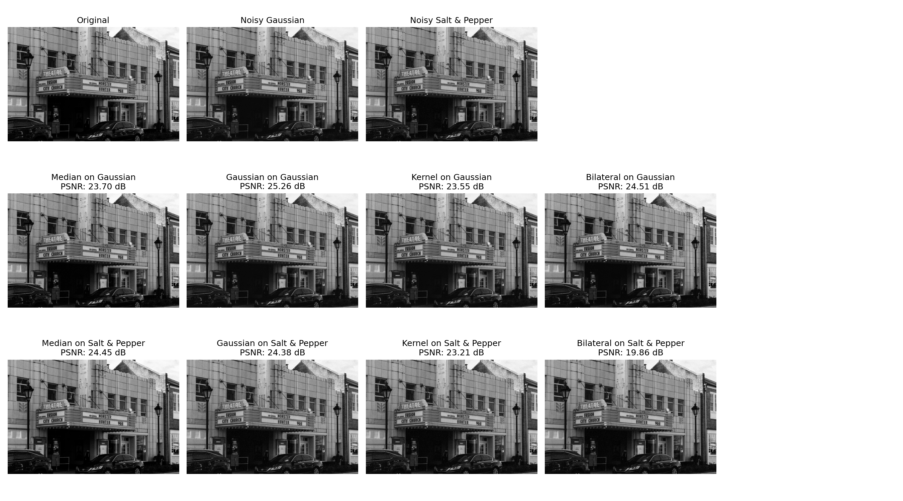
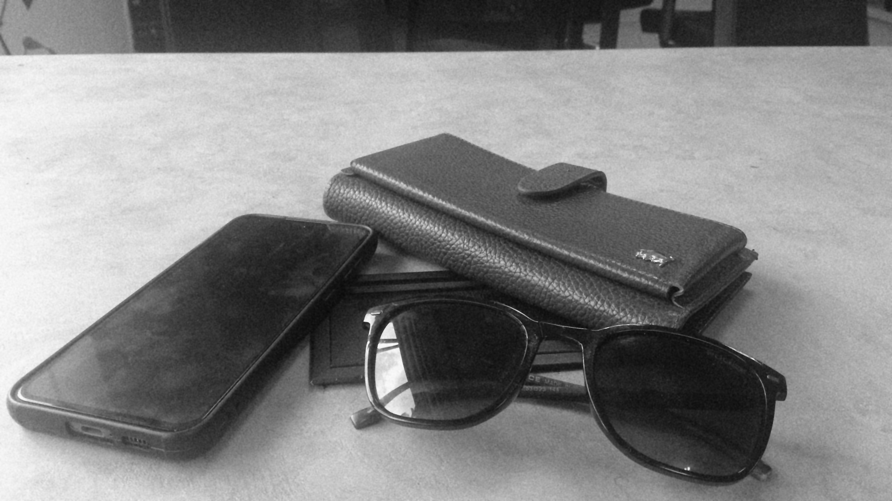

# گزارش دانشگاهی پروژه بینایی ماشین: حذف نویز از تصاویر با OpenCV

## چکیده
این گزارش به ارزیابی و تحلیل جامع یک سامانه حذف نویز تصویر در پایتون می‌پردازد که دو مدل نویز رایج (گوسی و نمک‌وفلفل) را اعمال کرده و چهار فیلتر استاندارد (میانه، گوسی، میانگین، دوطرفه) را برای بازسازی تصویر به‌کار می‌گیرد. پیاده‌سازی‌ها مبتنی بر OpenCV و NumPy بوده و ارزیابی کمی با PSNR و SSIM انجام می‌شود. نتایج کمی و کیفی نشان می‌دهند که فیلتر میانه در مقابله با نویز نمک‌وفلفل مؤثرترین عملکرد را دارد و فیلتر گوسی و دوطرفه برای نویز گوسی مناسب‌ترند؛ با این تفاوت که فیلتر دوطرفه لبه‌ها را بهتر حفظ می‌کند.

---

## مقدمه
نویز تصویری یکی از چالش‌های رایج در سامانه‌های بینایی ماشین است و می‌تواند بر ادراک، استخراج ویژگی و تصمیم‌گیری‌های بعدی اثر منفی بگذارد. این پروژه با هدف مقایسه‌ی علمی فیلترهای حذف نویز بر روی تصاویر خاکستری توسعه یافته است. معیارهای ارزیابی شامل نسبت سیگنال به نویز اوج (PSNR) و شاخص شباهت ساختاری (SSIM) هستند که به‌ترتیب سطح خطای بازسازی و حفظ ساختار تصویر را اندازه‌گیری می‌کنند.

### 🔧 مشخصات فنی پروژه
- **وابستگی‌ها**: در `requirements.txt` مشخص شده‌اند: NumPy، OpenCV، Matplotlib، scikit-image
- **مستندات**: کلی پروژه در `README.md` آمده است
- **ساختار پوشه‌ها**: 
  - `images/` برای تصاویر ورودی
  - `output/` برای خروجی‌ها و نتایج

---

## روش‌شناسی و معماری پیاده‌سازی
### معماری کلی
جریان اجرای برنامه در `main.py` به‌صورت گام‌به‌گام طراحی شده است:
- بارگذاری تصویر ورودی (`main.py:31-35`).
- اعمال نویز گوسی و نمک‌وفلفل (`main.py:41-43`).
- اعمال چهار فیلتر و ذخیره خروجی‌ها (`main.py:58-89`).
- ارزیابی کمی با PSNR و SSIM و چاپ جدول نتایج (`main.py:96-127`).
- تولید شکل مقایسه‌ای نهایی و ذخیره‌ی آن در `output/comparison_results.png` (`main.py:129-173`).

### مدل‌های نویز پیاده‌سازی‌شده
- نویز گوسی: تابع `add_gaussian_noise` در `utils.py:6-20` ورودی را به `float32` تبدیل کرده، نویز نرمال با میانگین و سیگما دلخواه تولید و سپس با کلیپ به بازه ۰ تا ۲۵۵ به `uint8` تبدیل می‌کند.
- نویز نمک‌وفلفل: تابع `add_salt_and_pepper_noise` در `utils.py:22-56` تعداد پیکسل‌های نمک و فلفل را بر اساس پارامتر `amount` تعیین می‌کند و برای تصاویر خاکستری (`ndim==2`) مختصات تصادفی انتخاب می‌کند؛ برای حالت‌های غیرخاکستری عمل روی آرایه تخت انجام می‌شود.

### فیلترهای حذف نویز
- فیلتر میانه: `cv2.medianBlur` با اندازه پنجره ۵ (`main.py:59-60`). برای حذف مؤثر مقادیر پرت ناشی از نویز نمک‌وفلفل.
- فیلتر گوسی: `cv2.GaussianBlur` با کرنل `5×5` (`main.py:67-68`). مناسب برای هموارسازی نویز گوسی.
- فیلتر میانگین (کرنل متوسط): کانولوشن با کرنل یکنواخت `5×5` (`main.py:75-81`). ساده و سریع اما با تاری قابل‌توجه.
- فیلتر دوطرفه: `cv2.bilateralFilter` با پارامترهای `(d=9, sigmaColor=75, sigmaSpace=75)` (`main.py:84-89`). هموارسازی وابسته به شدت و فاصله برای حفظ لبه‌ها.

### معیارهای ارزیابی
- **MSE**: `utils.py:58-64` میانگین مربعات خطا.
- **PSNR**: `utils.py:66-78` مبتنی بر MSE؛ هرچه بزرگ‌تر بهتر.
- **SSIM**: `utils.py:80-86` بر مبنای روشنایی، کنتراست و ساختار با `structural_similarity` از scikit-image.

---

## مجموعه‌داده و آماده‌سازی
- 📁 **تصویر ورودی**: باید در پوشه `images/` قرار گیرد و نام آن در متغیر `IMAGE_NAME` تنظیم شود (`main.py:19-21, 31`).
- 📂 **پوشه خروجی**: در اولین اجرا، پوشه `output/` ایجاد و کلیه نتایج در آن ذخیره می‌شوند (`main.py:21-27`).

---

## نتایج و تحلیل
### شکل مقایسه‌ای


📝 **توضیح شکل**: شکل فوق، خروجی‌های نویزدهی و فیلترها را در سه ردیف نمایش می‌دهد:
- **سطر اول**: تصویر اصلی و دو تصویر نویزی
- **سطر دوم**: فیلترها روی نویز گوسی  
- **سطر سوم**: فیلترها روی نویز نمک‌وفلفل

مقادیر PSNR روی هر پنجره درج شده‌اند.

### جدول نتایج کمی (از روی شکل)
| فیلتر | نویز | PSNR (dB) |
|:---|:---|:---:|
| **Median** | Gaussian | 23.70 |
| **Gaussian** | Gaussian | 25.26 |
| **Averaging Kernel** | Gaussian | 23.55 |
| **Bilateral** | Gaussian | 24.51 |
| **Median** | Salt & Pepper | 24.45 |
| **Gaussian** | Salt & Pepper | 24.38 |
| **Averaging Kernel** | Salt & Pepper | 23.21 |
| **Bilateral** | Salt & Pepper | 19.86 |

یادآوری: در کد، علاوه بر PSNR، مقادیر SSIM نیز محاسبه و در کنسول چاپ می‌شوند (`main.py:96-127`).

### جدول نتایج کمی (اجرای فعلی با `images/sample.jpg`)
| فیلتر | نویز | PSNR (dB) | SSIM |
|:---|:---|:---:|:---:|
| **Median** | Gaussian | 26.28 | 0.6134 |
| **Gaussian** | Gaussian | 27.19 | 0.6534 |
| **Averaging Kernel** | Gaussian | 25.88 | 0.6570 |
| **Bilateral** | Gaussian | 27.53 | 0.7190 |
| **Median** | Salt & Pepper | 27.81 | 0.8003 |
| **Gaussian** | Salt & Pepper | 25.74 | 0.5798 |
| **Averaging Kernel** | Salt & Pepper | 25.12 | 0.5918 |
| **Bilateral** | Salt & Pepper | 21.09 | 0.4299 |

### تحلیل کیفی
- نویز گوسی: در اجرای فعلی، فیلتر دوطرفه بیشترین PSNR و SSIM را دارد و لبه‌ها را بهتر حفظ می‌کند؛ فیلتر گوسی نزدیک به آن است و هموارسازی بیشتری ایجاد می‌کند.
- نویز نمک‌وفلفل: فیلتر میانه به‌طور چشمگیر مؤثر است؛ فیلتر دوطرفه به‌دلیل ماهیت ضربه‌ای نویز کارآمد نیست و افت قابل‌توجه دارد.
- فیلتر میانگین: ساده و سریع اما سبب تاری یکنواخت و افت جزئیات، در هر دو سناریو نسبت به گزینه‌های بهتر ضعیف‌تر است.

### توضیحات تصاویر خروجی

#### نویزدهی

- `noisy_gaussian.jpg`


- توضیح: نویز گوسی به‌صورت افزایشی و با توزیع نرمال به تصویر اعمال می‌شود. اثر آن به شکل دانه‌دانه و هموارسازی عمومی ظاهر می‌گردد و باعث افت جزئیات ریز و نرم‌شدن مرزها می‌شود. مقادیر کمی (PSNR/SSIM) مطابق جدول نتایج کمی گزارش افزایش/کاهش کیفیت را نشان می‌دهند.

- `noisy_salt_pepper.jpg`


- توضیح: نویز نمک‌وفلفل از نوع ضربه‌ای است و پیکسل‌ها را به‌طور تصادفی به ۰ یا ۲۵۵ می‌رساند؛ نقاط سیاه‌وسفید پررنگ در تصویر ظاهر می‌شوند و لبه‌ها تحت تأثیر قرار می‌گیرند.

#### فیلترها روی نویز گوسی

- `denoised_median_on_gaussian.jpg`


- توضیح: فیلتر میانه برای حذف مقادیر پرت مؤثر است؛ روی نویز گوسی عملکرد متوسط دارد و می‌تواند برخی جزئیات را از بین ببرد و لبه‌ها را تاحدی نرم کند.

- `denoised_gaussian_on_gaussian.jpg`


- توضیح: فیلتر گوسی با هموارسازی مبتنی بر توزیع نرمال، نویز گوسی را مؤثرتر کاهش می‌دهد. ساختار کلی تصویر حفظ می‌شود ولی لبه‌ها نرم‌تر می‌شوند.

- `denoised_kernel_on_gaussian.jpg`


- توضیح: فیلتر میانگین یکنواخت سبب هموارسازی کلی تصویر می‌شود؛ نسبت به فیلتر گوسی و دوطرفه، لبه‌ها را بیشتر تار می‌کند و ممکن است جزئیات ظریف را محو کند.

- `denoised_bilateral_on_gaussian.jpg`



- توضیح: فیلتر دوطرفه با درنظرگرفتن شباهت شدت و فاصله، نویز را کاهش داده و لبه‌ها را حفظ می‌کند. در برابر نویز گوسی معمولاً بهترین توازن بین کاهش نویز و حفظ ساختار را ارائه می‌دهد.

#### فیلترها روی نویز نمک‌وفلفل

- `denoised_median_on_salt_pepper.jpg`


- توضیح: فیلتر میانه بهترین گزینه برای نویز ضربه‌ای است؛ نقاط نمک‌وفلفل را مؤثر حذف کرده و با کم‌ترین آسیب به لبه‌ها تصویر را بازیابی می‌کند.

- `denoised_gaussian_on_salt_pepper.jpg`


- توضیح: فیلتر گوسی برای نویز نمک‌وفلفل مناسب نیست؛ نقاط ضربه‌ای باقی می‌مانند و هموارسازی عمومی ممکن است باعث تاری اضافه شود.

- `denoised_kernel_on_salt_pepper.jpg`


- توضیح: فیلتر میانگین در حذف نویز ضربه‌ای کارایی محدودی دارد؛ نقاط سیاه‌وسفید می‌توانند به‌صورت هاله‌های تار پخش شوند.

- `denoised_bilateral_on_salt_pepper.jpg`


- توضیح: فیلتر دوطرفه برای نویز ضربه‌ای گزینه‌ی ایده‌آلی نیست؛ اگرچه در حفظ لبه‌ها خوب عمل می‌کند، بسیاری از نقاط ضربه‌ای باقی می‌مانند و کیفیت کمی نسبت به میانه پایین‌تر است.

---

## مقایسه و بحث فنی
- تفاوت ماهوی فیلترها: فیلترهای خطی (گوسی، میانگین) در برابر نویز افزودنی با توزیع پیوسته (گوسی) مؤثرترند؛ فیلترهای غیرخطی (میانه) برای نویز ضربه‌ای/پرت (نمک‌وفلفل) مناسب‌ترند. فیلتر دوطرفه از معیار شباهت شدت برای حفظ لبه‌ها استفاده می‌کند.
- انتخاب پارامترها: اندازه پنجره ۵ برای میانه و گوسی در این پروژه انتخاب شده است؛ بزرگ‌تر شدن پنجره سبب افزایش هموارسازی و امکان از دست رفتن جزئیات می‌شود. پارامترهای دوطرفه (`d, sigmaColor, sigmaSpace`) حساس‌اند و نیاز به تنظیم تجربی دارند.
- ملاحظات عملی: تبدیل نوع داده به `float32` و کلیپ کردن محدوده‌ی شدت در نویزدهی (در `utils.py:6-20`) از بروز اشباع غیرواقعی جلوگیری می‌کند. در SSIM باید `data_range` مطابق دامنه‌ی شدت تنظیم شود (`utils.py:80-86`).
- کارایی محاسباتی: فیلتر میانگین و گوسی محاسبات سبک‌تری نسبت به دوطرفه دارند؛ دوطرفه به‌ویژه روی تصاویر بزرگ هزینه‌بر است.

---

## جمع‌بندی و نکات کلیدی
- برای نویز نمک‌وفلفل، فیلتر میانه بهترین انتخاب است؛ ترکیب اندازه‌ی پنجره و چندین پاس می‌تواند نتیجه را بهبود دهد.
- برای نویز گوسی، در اجرای فعلی فیلتر دوطرفه بهترین حفظ ساختار و PSNR نزدیک به یا بالاتر از گوسی را ارائه می‌دهد؛ فیلتر گوسی ساده‌تر و سریع‌تر است و در نبود نیاز شدید به حفظ لبه‌ها انتخاب مناسبی است.
- ارزیابی کمی باید هم‌زمان به PSNR و SSIM توجه کند؛ ممکن است فیلترها در یکی بهتر و در دیگری ضعیف‌تر باشند.
- طراحی ماژولار توابع در `utils.py` و خط لوله‌ی روشن در `main.py` توسعه‌پذیری پروژه را تسهیل می‌کند.

---

## کدهای نمونه مرتبط با بخش‌ها
### افزودن نویز گوسی
```python
from utils import add_gaussian_noise
noisy_gaussian = add_gaussian_noise(original_image, sigma=25)
```

### افزودن نویز نمک‌وفلفل
```python
from utils import add_salt_and_pepper_noise
noisy_sap = add_salt_and_pepper_noise(original_image, amount=0.05)
```

### اعمال فیلترها
```python
import cv2
median_gauss = cv2.medianBlur(noisy_gaussian, 5)
gauss_gauss = cv2.GaussianBlur(noisy_gaussian, (5, 5), 0)
avg_kernel = np.ones((5,5), np.float32) / 25
avg_gauss = cv2.filter2D(noisy_gaussian, -1, avg_kernel)
bilateral_gauss = cv2.bilateralFilter(noisy_gaussian, 9, 75, 75)
```

### ارزیابی کمی
```python
from utils import calculate_psnr, calculate_ssim
psnr_score = calculate_psnr(original_image, denoised_img)
ssim_score = calculate_ssim(original_image, denoised_img)
```

### تولید شکل مقایسه‌ای
```python
import matplotlib.pyplot as plt
fig, axes = plt.subplots(3, 5, figsize=(18, 10))
# ... درج تصاویر و عناوین ...
plt.savefig('output/comparison_results.png', dpi=150)
```

---

## پیوست: ارجاع به کدها
- بارگذاری تصویر و آماده‌سازی مسیرها: `main.py:18-27, 31-38`
- نویزدهی: `main.py:41-43` و توابع `utils.py:6-20, 22-56`
- اعمال فیلترها: `main.py:58-89`
- ارزیابی PSNR/SSIM و چاپ جدول: `main.py:96-127`
- تولید شکل نهایی: `main.py:129-173`
- تعریف متریک‌ها: `utils.py:58-86`

---
